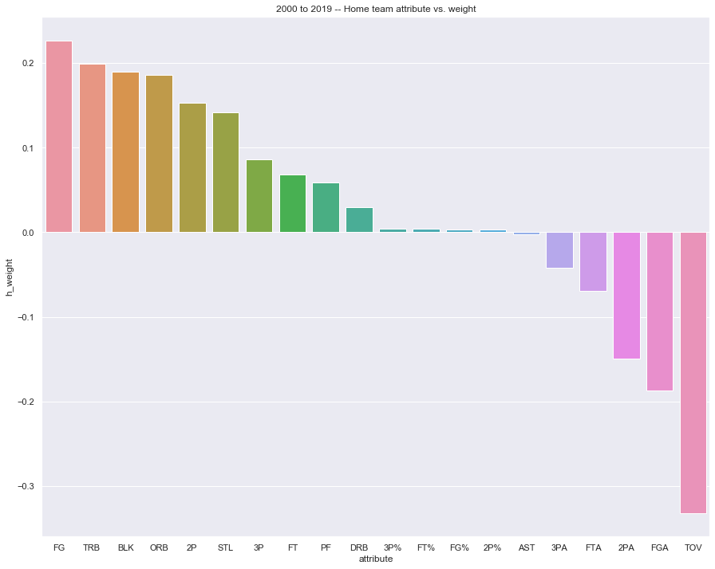

## Data scrapping and cleaning


```python
import requests
import pandas as pd
from bs4 import Comment
from bs4 import BeautifulSoup
```


```python
df = pd.DataFrame()
df2 = pd.DataFrame()
df3 = pd.DataFrame()

# Set time period --> from 2000 to 2020
for year in range(2000,2020):
    # Get the seasonal stats for each team
    url = 'https://www.basketball-reference.com/leagues/NBA_{}.html#all_team-stats-base'.format(str(year))
    page = requests.get(url)

    soup = BeautifulSoup(page.text, 'html.parser')
    comments = soup.find_all(string=lambda text: isinstance(text, Comment))

    tables = []
    for each in comments:
        if 'table' in each:
            try:
                tables.append(pd.read_html(each)[0])
            except:
                continue
    
    # Miscellaneous stats, including technical analysis like usage rate and offensive rating
    tmp = tables[7]
    tmp.columns = tmp.columns.droplevel()
    tmp.drop(tmp[tmp['Team'] == 'League Average'].index, inplace = True)
    tmp.insert(1,'yearID',str(year))
    del tmp['Rk']
    del tmp['Arena']
    
    df = df.append(tmp)
    
    # Per Game Stats, including points, assist, block, turnover, 3 Pointer
    tmp2 = tables[1]
    tmp2.drop(tmp2[tmp2['Team'] == 'League Average'].index, inplace = True)
    tmp2.insert(0,'yearID',str(year))
    df3 = df3.append(tmp2)
    
    # Get each game's data, including home team, away team, score
    url = 'https://www.basketball-reference.com/leagues/NBA_{}_games.html'.format(str(year))
    page = requests.get(url)
    soup = BeautifulSoup(page.text, 'html.parser')
    
    table = soup.find('div', class_='overthrow table_container')
    rows = table.find_all('tr')
    
    data = [[],[],[],[]]
    
    for r in rows:
        tmp = r.find_all('td')
        for idx, val in enumerate(tmp):
            
            tmp = val.text
            
            if year <= 2000:
                idx = idx + 1
            
            if idx == 1 or idx == 3:
                data[idx-1].append(tmp)
            elif idx == 2 or idx == 4:
                data[idx-1].append(int(tmp))
    
    # Use the score for each team and convert that into a single categorical attribute
    home_win = [0 if (data[1])[i] < (data[3])[i] else 1 for i in range(len(data[2]))]

    
    d = {'home_team' : data[0],'away_team' : data[2], 'home_win': home_win}
    schedule = pd.DataFrame(d)
    schedule.insert(0,'yearID',str(year))
    df2 = df2.append(schedule)
```


```python
# Join Per Game Stats with Miscellaneous stats on year and team name
df = df.merge(df3, on = ['Team', 'yearID'], suffixes=(False, False))

name = [i.replace('*','') if '*' in i else i for i in df.Team.tolist()]
new_df = pd.DataFrame({'Team': name})
```


```python
df.update(new_df)
df
```


<div>
<style scoped>
    .dataframe tbody tr th:only-of-type {
        vertical-align: middle;
    }

    .dataframe tbody tr th {
        vertical-align: top;
    }

    .dataframe thead th {
        text-align: right;
    }
</style>
<table border="1" class="dataframe">
  <thead>
    <tr style="text-align: right;">
      <th></th>
      <th>yearID</th>
      <th>Team</th>
      <th>Age</th>
      <th>W</th>
      <th>L</th>
      <th>PW</th>
      <th>PL</th>
      <th>MOV</th>
      <th>SOS</th>
      <th>SRS</th>
      <th>...</th>
      <th>FT%</th>
      <th>ORB</th>
      <th>DRB</th>
      <th>TRB</th>
      <th>AST</th>
      <th>STL</th>
      <th>BLK</th>
      <th>TOV</th>
      <th>PF</th>
      <th>PTS</th>
    </tr>
  </thead>
  <tbody>
    <tr>
      <th>0</th>
      <td>2000</td>
      <td>Los Angeles Lakers</td>
      <td>29.2</td>
      <td>67.0</td>
      <td>15.0</td>
      <td>64</td>
      <td>18</td>
      <td>8.55</td>
      <td>-0.14</td>
      <td>8.41</td>
      <td>...</td>
      <td>0.696</td>
      <td>13.6</td>
      <td>33.4</td>
      <td>47.0</td>
      <td>23.4</td>
      <td>7.5</td>
      <td>6.5</td>
      <td>13.9</td>
      <td>22.5</td>
      <td>100.8</td>
    </tr>
    <tr>
      <th>1</th>
      <td>2000</td>
      <td>Portland Trail Blazers</td>
      <td>29.6</td>
      <td>59.0</td>
      <td>23.0</td>
      <td>59</td>
      <td>23</td>
      <td>6.40</td>
      <td>-0.04</td>
      <td>6.36</td>
      <td>...</td>
      <td>0.760</td>
      <td>11.8</td>
      <td>31.2</td>
      <td>43.0</td>
      <td>23.5</td>
      <td>7.7</td>
      <td>4.8</td>
      <td>15.2</td>
      <td>22.7</td>
      <td>97.5</td>
    </tr>
    <tr>
      <th>2</th>
      <td>2000</td>
      <td>San Antonio Spurs</td>
      <td>30.9</td>
      <td>53.0</td>
      <td>29.0</td>
      <td>58</td>
      <td>24</td>
      <td>5.94</td>
      <td>-0.02</td>
      <td>5.92</td>
      <td>...</td>
      <td>0.746</td>
      <td>11.3</td>
      <td>32.5</td>
      <td>43.8</td>
      <td>22.2</td>
      <td>7.5</td>
      <td>6.7</td>
      <td>15.0</td>
      <td>20.9</td>
      <td>96.2</td>
    </tr>
    <tr>
      <th>3</th>
      <td>2000</td>
      <td>Phoenix Suns</td>
      <td>28.6</td>
      <td>53.0</td>
      <td>29.0</td>
      <td>56</td>
      <td>26</td>
      <td>5.22</td>
      <td>0.02</td>
      <td>5.24</td>
      <td>...</td>
      <td>0.759</td>
      <td>12.5</td>
      <td>31.2</td>
      <td>43.7</td>
      <td>25.6</td>
      <td>9.1</td>
      <td>5.3</td>
      <td>16.7</td>
      <td>24.1</td>
      <td>98.9</td>
    </tr>
    <tr>
      <th>4</th>
      <td>2000</td>
      <td>Utah Jazz</td>
      <td>31.5</td>
      <td>55.0</td>
      <td>27.0</td>
      <td>54</td>
      <td>28</td>
      <td>4.46</td>
      <td>0.05</td>
      <td>4.52</td>
      <td>...</td>
      <td>0.773</td>
      <td>11.4</td>
      <td>29.6</td>
      <td>41.0</td>
      <td>24.9</td>
      <td>7.7</td>
      <td>5.4</td>
      <td>14.9</td>
      <td>24.5</td>
      <td>96.5</td>
    </tr>
    <tr>
      <th>...</th>
      <td>...</td>
      <td>...</td>
      <td>...</td>
      <td>...</td>
      <td>...</td>
      <td>...</td>
      <td>...</td>
      <td>...</td>
      <td>...</td>
      <td>...</td>
      <td>...</td>
      <td>...</td>
      <td>...</td>
      <td>...</td>
      <td>...</td>
      <td>...</td>
      <td>...</td>
      <td>...</td>
      <td>...</td>
      <td>...</td>
      <td>...</td>
    </tr>
    <tr>
      <th>590</th>
      <td>2019</td>
      <td>Atlanta Hawks</td>
      <td>25.1</td>
      <td>29.0</td>
      <td>53.0</td>
      <td>27</td>
      <td>55</td>
      <td>-6.02</td>
      <td>-0.04</td>
      <td>-6.06</td>
      <td>...</td>
      <td>0.752</td>
      <td>11.6</td>
      <td>34.5</td>
      <td>46.1</td>
      <td>25.8</td>
      <td>8.2</td>
      <td>5.1</td>
      <td>17.0</td>
      <td>23.6</td>
      <td>113.3</td>
    </tr>
    <tr>
      <th>591</th>
      <td>2019</td>
      <td>Chicago Bulls</td>
      <td>24.0</td>
      <td>22.0</td>
      <td>60.0</td>
      <td>21</td>
      <td>61</td>
      <td>-8.41</td>
      <td>0.10</td>
      <td>-8.32</td>
      <td>...</td>
      <td>0.783</td>
      <td>8.8</td>
      <td>34.1</td>
      <td>42.9</td>
      <td>21.9</td>
      <td>7.4</td>
      <td>4.3</td>
      <td>14.1</td>
      <td>20.3</td>
      <td>104.9</td>
    </tr>
    <tr>
      <th>592</th>
      <td>2019</td>
      <td>Phoenix Suns</td>
      <td>24.0</td>
      <td>19.0</td>
      <td>63.0</td>
      <td>19</td>
      <td>63</td>
      <td>-9.34</td>
      <td>0.73</td>
      <td>-8.61</td>
      <td>...</td>
      <td>0.779</td>
      <td>9.1</td>
      <td>31.3</td>
      <td>40.4</td>
      <td>23.9</td>
      <td>9.0</td>
      <td>5.1</td>
      <td>15.6</td>
      <td>23.6</td>
      <td>107.5</td>
    </tr>
    <tr>
      <th>593</th>
      <td>2019</td>
      <td>New York Knicks</td>
      <td>23.4</td>
      <td>17.0</td>
      <td>65.0</td>
      <td>19</td>
      <td>63</td>
      <td>-9.21</td>
      <td>0.28</td>
      <td>-8.93</td>
      <td>...</td>
      <td>0.759</td>
      <td>10.5</td>
      <td>34.3</td>
      <td>44.7</td>
      <td>20.1</td>
      <td>6.8</td>
      <td>5.1</td>
      <td>14.0</td>
      <td>20.9</td>
      <td>104.6</td>
    </tr>
    <tr>
      <th>594</th>
      <td>2019</td>
      <td>Cleveland Cavaliers</td>
      <td>25.2</td>
      <td>19.0</td>
      <td>63.0</td>
      <td>19</td>
      <td>63</td>
      <td>-9.61</td>
      <td>0.22</td>
      <td>-9.39</td>
      <td>...</td>
      <td>0.792</td>
      <td>10.7</td>
      <td>31.9</td>
      <td>42.7</td>
      <td>20.7</td>
      <td>6.5</td>
      <td>2.4</td>
      <td>13.5</td>
      <td>20.0</td>
      <td>104.5</td>
    </tr>
  </tbody>
</table>
<p>595 rows × 51 columns</p>
</div>


```python
# Match the stats for each team in the record for each game
title = df.columns.tolist()[30:50]
h_stats = [[] for x in range(len(title))]
a_stats = [[] for x in range(len(title))]

yr = df2['yearID'].tolist()
hn = df2['home_team'].tolist()
an = df2['away_team'].tolist()

for i in range(len(yr)):
    h_item = df[(df.Team == hn[i]) & (df.yearID == yr[i])]
    a_item = df[(df.Team == an[i]) & (df.yearID == yr[i])]
    for j in range(len(title)):
        h_val = h_item[title[j]].tolist()
        h_stats[j].append(h_val[0])
        
        a_val = a_item[title[j]].tolist()
        a_stats[j].append(a_val[0])
        
for index, item in enumerate(title):
    h_item = 'h_' + item
    a_item = 'a_' + item
    df2[h_item] = h_stats[index]
    df2[a_item] = a_stats[index]
```


```python
df2['yearID'] = df2['yearID'].astype('int64')
df2
```


<div>
<style scoped>
    .dataframe tbody tr th:only-of-type {
        vertical-align: middle;
    }

    .dataframe tbody tr th {
        vertical-align: top;
    }

    .dataframe thead th {
        text-align: right;
    }
</style>
<table border="1" class="dataframe">
  <thead>
    <tr style="text-align: right;">
      <th></th>
      <th>yearID</th>
      <th>home_team</th>
      <th>away_team</th>
      <th>home_win</th>
      <th>h_FG</th>
      <th>a_FG</th>
      <th>h_FGA</th>
      <th>a_FGA</th>
      <th>h_FG%</th>
      <th>a_FG%</th>
      <th>...</th>
      <th>h_AST</th>
      <th>a_AST</th>
      <th>h_STL</th>
      <th>a_STL</th>
      <th>h_BLK</th>
      <th>a_BLK</th>
      <th>h_TOV</th>
      <th>a_TOV</th>
      <th>h_PF</th>
      <th>a_PF</th>
    </tr>
  </thead>
  <tbody>
    <tr>
      <th>0</th>
      <td>2000</td>
      <td>Orlando Magic</td>
      <td>Charlotte Hornets</td>
      <td>0</td>
      <td>38.6</td>
      <td>35.8</td>
      <td>85.5</td>
      <td>79.7</td>
      <td>0.452</td>
      <td>0.449</td>
      <td>...</td>
      <td>20.8</td>
      <td>24.7</td>
      <td>9.1</td>
      <td>8.9</td>
      <td>5.7</td>
      <td>5.9</td>
      <td>17.6</td>
      <td>14.7</td>
      <td>24.0</td>
      <td>20.4</td>
    </tr>
    <tr>
      <th>1</th>
      <td>2000</td>
      <td>Golden State Warriors</td>
      <td>Dallas Mavericks</td>
      <td>0</td>
      <td>36.5</td>
      <td>39.0</td>
      <td>87.1</td>
      <td>85.9</td>
      <td>0.420</td>
      <td>0.453</td>
      <td>...</td>
      <td>22.6</td>
      <td>22.1</td>
      <td>8.9</td>
      <td>7.2</td>
      <td>4.3</td>
      <td>5.1</td>
      <td>15.9</td>
      <td>13.7</td>
      <td>24.9</td>
      <td>21.6</td>
    </tr>
    <tr>
      <th>2</th>
      <td>2000</td>
      <td>Phoenix Suns</td>
      <td>Denver Nuggets</td>
      <td>0</td>
      <td>37.7</td>
      <td>37.3</td>
      <td>82.6</td>
      <td>84.3</td>
      <td>0.457</td>
      <td>0.442</td>
      <td>...</td>
      <td>25.6</td>
      <td>23.3</td>
      <td>9.1</td>
      <td>6.8</td>
      <td>5.3</td>
      <td>7.5</td>
      <td>16.7</td>
      <td>15.6</td>
      <td>24.1</td>
      <td>23.9</td>
    </tr>
    <tr>
      <th>3</th>
      <td>2000</td>
      <td>Milwaukee Bucks</td>
      <td>Houston Rockets</td>
      <td>1</td>
      <td>38.7</td>
      <td>36.6</td>
      <td>83.3</td>
      <td>81.3</td>
      <td>0.465</td>
      <td>0.450</td>
      <td>...</td>
      <td>22.6</td>
      <td>21.6</td>
      <td>8.2</td>
      <td>7.5</td>
      <td>4.6</td>
      <td>5.3</td>
      <td>15.0</td>
      <td>17.4</td>
      <td>24.6</td>
      <td>20.3</td>
    </tr>
    <tr>
      <th>4</th>
      <td>2000</td>
      <td>Seattle SuperSonics</td>
      <td>Los Angeles Clippers</td>
      <td>1</td>
      <td>37.9</td>
      <td>35.1</td>
      <td>84.7</td>
      <td>82.4</td>
      <td>0.447</td>
      <td>0.426</td>
      <td>...</td>
      <td>22.9</td>
      <td>18.0</td>
      <td>8.0</td>
      <td>7.0</td>
      <td>4.2</td>
      <td>6.0</td>
      <td>14.0</td>
      <td>16.2</td>
      <td>21.7</td>
      <td>22.2</td>
    </tr>
    <tr>
      <th>...</th>
      <td>...</td>
      <td>...</td>
      <td>...</td>
      <td>...</td>
      <td>...</td>
      <td>...</td>
      <td>...</td>
      <td>...</td>
      <td>...</td>
      <td>...</td>
      <td>...</td>
      <td>...</td>
      <td>...</td>
      <td>...</td>
      <td>...</td>
      <td>...</td>
      <td>...</td>
      <td>...</td>
      <td>...</td>
      <td>...</td>
      <td>...</td>
    </tr>
    <tr>
      <th>105</th>
      <td>2019</td>
      <td>Utah Jazz</td>
      <td>Minnesota Timberwolves</td>
      <td>0</td>
      <td>40.4</td>
      <td>41.6</td>
      <td>86.4</td>
      <td>91.3</td>
      <td>0.468</td>
      <td>0.456</td>
      <td>...</td>
      <td>26.0</td>
      <td>24.6</td>
      <td>8.1</td>
      <td>8.3</td>
      <td>5.9</td>
      <td>5.0</td>
      <td>15.1</td>
      <td>13.1</td>
      <td>21.1</td>
      <td>20.3</td>
    </tr>
    <tr>
      <th>106</th>
      <td>2019</td>
      <td>Indiana Pacers</td>
      <td>New York Knicks</td>
      <td>1</td>
      <td>41.3</td>
      <td>38.2</td>
      <td>87.0</td>
      <td>88.3</td>
      <td>0.475</td>
      <td>0.433</td>
      <td>...</td>
      <td>26.0</td>
      <td>20.1</td>
      <td>8.7</td>
      <td>6.8</td>
      <td>4.9</td>
      <td>5.1</td>
      <td>13.7</td>
      <td>14.0</td>
      <td>19.4</td>
      <td>20.9</td>
    </tr>
    <tr>
      <th>107</th>
      <td>2019</td>
      <td>New Orleans Pelicans</td>
      <td>Golden State Warriors</td>
      <td>0</td>
      <td>43.7</td>
      <td>44.0</td>
      <td>92.2</td>
      <td>89.8</td>
      <td>0.473</td>
      <td>0.491</td>
      <td>...</td>
      <td>27.0</td>
      <td>29.4</td>
      <td>7.4</td>
      <td>7.6</td>
      <td>5.4</td>
      <td>6.4</td>
      <td>14.8</td>
      <td>14.3</td>
      <td>21.1</td>
      <td>21.4</td>
    </tr>
    <tr>
      <th>108</th>
      <td>2019</td>
      <td>Dallas Mavericks</td>
      <td>Los Angeles Lakers</td>
      <td>0</td>
      <td>38.8</td>
      <td>42.6</td>
      <td>86.9</td>
      <td>90.5</td>
      <td>0.447</td>
      <td>0.470</td>
      <td>...</td>
      <td>23.4</td>
      <td>25.6</td>
      <td>6.5</td>
      <td>7.5</td>
      <td>4.3</td>
      <td>5.4</td>
      <td>14.2</td>
      <td>15.7</td>
      <td>20.1</td>
      <td>20.7</td>
    </tr>
    <tr>
      <th>109</th>
      <td>2019</td>
      <td>San Antonio Spurs</td>
      <td>Phoenix Suns</td>
      <td>1</td>
      <td>42.3</td>
      <td>40.1</td>
      <td>88.4</td>
      <td>87.4</td>
      <td>0.478</td>
      <td>0.459</td>
      <td>...</td>
      <td>24.5</td>
      <td>23.9</td>
      <td>6.1</td>
      <td>9.0</td>
      <td>4.7</td>
      <td>5.1</td>
      <td>12.1</td>
      <td>15.6</td>
      <td>18.1</td>
      <td>23.6</td>
    </tr>
  </tbody>
</table>
<p>1240 rows × 44 columns</p>
</div>


```python
df.to_csv(r'C:\\Users\\TomTu\\OneDrive - University of Maryland\\2020 Spring\\CMSC 320\\\nba_data.csv', index = False)
df2.to_csv(r'C:\\Users\\TomTu\\OneDrive - University of Maryland\\2020 Spring\\CMSC 320\\\game_data.csv', index = False)
```

## Model training


```python
import numpy as np
import sklearn.metrics
import seaborn as sns
import matplotlib.pylab as plt
import statsmodels.formula.api as sm
from sklearn.linear_model import LogisticRegression
from sklearn.metrics import mean_squared_error
from sklearn.model_selection import train_test_split, KFold
```


```python
sns.set(rc={'figure.figsize':(15,12)})
```

We tried to train with data before 2000, but since the rules have been changing, older data is not a good for the model no more. The best timeframe I found is about 2000 to 2019. And this is what I went with. 


```python
tmp = df2.columns.tolist()[4:50]
train = df2[df2.yearID < 2019]
test = df2[df2.yearID == 2019]

x_train = train[tmp]
x_test = test[tmp]
y_train = train.home_win
y_test = test.home_win
```


```python
model = LogisticRegression(n_jobs=8)
model.fit(x_train, y_train)
```


    LogisticRegression(C=1.0, class_weight=None, dual=False, fit_intercept=True,
                       intercept_scaling=1, l1_ratio=None, max_iter=100,
                       multi_class='auto', n_jobs=8, penalty='l2',
                       random_state=None, solver='lbfgs', tol=0.0001, verbose=0,
                       warm_start=False)


```python
y_test_pred = model.predict(x_test)
y_train_pred = model.predict(x_train)
```


```python
mse_train = mean_squared_error(y_train, y_train_pred)
mse_test = mean_squared_error(y_test, y_test_pred)
score_trian = model.score(x_train, y_train)
score_test = model.score(x_test, y_test)

print("mse_train: {}\nmse_test: {}\nscore_trian: {}\nscore_test: {}\n".format(mse_train,mse_test,score_trian,score_test))
```

    mse_train: 0.3070796460176991
    mse_test: 0.2636363636363636
    score_trian: 0.6929203539823009
    score_test: 0.7363636363636363
    
    

Since there are only limited data due to rule changes, and there are only around 80 games each season, the best I can achieve is around 73.6%, which is not bad, and also much better as compared to a random guess (50%). 


```python
output = pd.DataFrame()

a_tmp = [-1 * x for x in model.coef_[0][1::2]]

output['attribute'] = title
output['h_weight'] = model.coef_[0][::2]
output['a_weight'] = a_tmp

output
```


<div>
<style scoped>
    .dataframe tbody tr th:only-of-type {
        vertical-align: middle;
    }

    .dataframe tbody tr th {
        vertical-align: top;
    }

    .dataframe thead th {
        text-align: right;
    }
</style>
<table border="1" class="dataframe">
  <thead>
    <tr style="text-align: right;">
      <th></th>
      <th>attribute</th>
      <th>h_weight</th>
      <th>a_weight</th>
    </tr>
  </thead>
  <tbody>
    <tr>
      <th>0</th>
      <td>FG</td>
      <td>0.226895</td>
      <td>0.194331</td>
    </tr>
    <tr>
      <th>1</th>
      <td>FGA</td>
      <td>-0.186685</td>
      <td>-0.153776</td>
    </tr>
    <tr>
      <th>2</th>
      <td>FG%</td>
      <td>0.003272</td>
      <td>0.003851</td>
    </tr>
    <tr>
      <th>3</th>
      <td>3P</td>
      <td>0.086181</td>
      <td>0.070963</td>
    </tr>
    <tr>
      <th>4</th>
      <td>3PA</td>
      <td>-0.041852</td>
      <td>-0.076499</td>
    </tr>
    <tr>
      <th>5</th>
      <td>3P%</td>
      <td>0.003980</td>
      <td>0.007332</td>
    </tr>
    <tr>
      <th>6</th>
      <td>2P</td>
      <td>0.153479</td>
      <td>0.110015</td>
    </tr>
    <tr>
      <th>7</th>
      <td>2PA</td>
      <td>-0.149417</td>
      <td>-0.090220</td>
    </tr>
    <tr>
      <th>8</th>
      <td>2P%</td>
      <td>0.002929</td>
      <td>0.002201</td>
    </tr>
    <tr>
      <th>9</th>
      <td>FT</td>
      <td>0.068581</td>
      <td>0.088320</td>
    </tr>
    <tr>
      <th>10</th>
      <td>FTA</td>
      <td>-0.069059</td>
      <td>-0.074324</td>
    </tr>
    <tr>
      <th>11</th>
      <td>FT%</td>
      <td>0.003845</td>
      <td>0.005520</td>
    </tr>
    <tr>
      <th>12</th>
      <td>ORB</td>
      <td>0.185919</td>
      <td>0.059421</td>
    </tr>
    <tr>
      <th>13</th>
      <td>DRB</td>
      <td>0.029739</td>
      <td>0.093776</td>
    </tr>
    <tr>
      <th>14</th>
      <td>TRB</td>
      <td>0.199245</td>
      <td>0.147955</td>
    </tr>
    <tr>
      <th>15</th>
      <td>AST</td>
      <td>-0.002619</td>
      <td>0.011860</td>
    </tr>
    <tr>
      <th>16</th>
      <td>STL</td>
      <td>0.142090</td>
      <td>0.207814</td>
    </tr>
    <tr>
      <th>17</th>
      <td>BLK</td>
      <td>0.190082</td>
      <td>0.000109</td>
    </tr>
    <tr>
      <th>18</th>
      <td>TOV</td>
      <td>-0.331940</td>
      <td>-0.277124</td>
    </tr>
    <tr>
      <th>19</th>
      <td>PF</td>
      <td>0.058421</td>
      <td>-0.031567</td>
    </tr>
  </tbody>
</table>
</div>


```python
sns.barplot(x = "attribute", y = "h_weight", data = output.sort_values(by=['h_weight'], ascending=False))
plt.title('2000 to 2019 -- Home team attribute vs. weight')
plt.show()
sns.barplot(x = "attribute", y = "a_weight", data = output.sort_values(by=['a_weight'], ascending=False))
plt.title('2000 to 2019 -- Away team attribute vs. weight')
plt.show()
```





From graph, we can see that for the past 20 years as a whole, the most import factors that contribute to winning a game are field goals made, total rebounds, blocks, two-point field goals made, steal, three-point field goals made, and turnover will hurt a team the most. 

For away teams, surprisingly, steals contirbutes to road wins the most, then the same story as it somes to field goals made, total rebounds, two-point field goals made, free throws made and three-point field goals made. It's not surprising that turnovers will also hurt a team the most.

### One more thing

Before I finish the study, I think I should look at the rise of the golden state warrios's time period. So I re-trained the model with data only between 2014 to 2018, and try to see how good it is at predicting the 2018-2019 season. 


```python
tmp = df2.columns.tolist()[4:50]
train = df2[(df2.yearID < 2019) & (df2.yearID >= 2014)]
test = df2[df2.yearID == 2019]

x_train = train[tmp]
x_test = test[tmp]
y_train = train.home_win
y_test = test.home_win
```


```python
model = LogisticRegression(n_jobs=8)
model.fit(x_train, y_train)

y_test_pred = model.predict(x_test)
y_train_pred = model.predict(x_train)

mse_train = mean_squared_error(y_train, y_train_pred)
mse_test = mean_squared_error(y_test, y_test_pred)
score_trian = model.score(x_train, y_train)
score_test = model.score(x_test, y_test)

print("mse_train: {}\nmse_test: {}\nscore_trian: {}\nscore_test: {}\n".format(mse_train,mse_test,score_trian,score_test))
```

    mse_train: 0.2974137931034483
    mse_test: 0.2909090909090909
    score_trian: 0.7025862068965517
    score_test: 0.7090909090909091
    
    

So I got a 70.9% correct rate for this reduced model. It's reasonable to see a drop in correctness, as there are less data. But what I care the most is to find which are the most important factors during 2014 to 2018. 


```python
output = pd.DataFrame()

a_tmp = [-1 * x for x in model.coef_[0][1::2]]

output['attribute'] = title
output['h_weight'] = model.coef_[0][::2]
output['a_weight'] = a_tmp

sns.barplot(x = "attribute", y = "h_weight", data = output.sort_values(by=['h_weight'], ascending=False))
plt.title('2014 to 2018 -- Home team attribute vs. weight')
plt.show()
sns.barplot(x = "attribute", y = "a_weight", data = output.sort_values(by=['a_weight'], ascending=False))
plt.title('2014 to 2018 -- Away team attribute vs. weight')
plt.show()
```


From the graph above, I got the same result as I predicted: three pointers are the most important contributor as a home team gets a win. For the previus model, where we are using the past 20 years to do the prediction, 3P were both ranked 7th as for the contributor. Besides home team, we can also see that the 3P's importance was raised and now is ranked 4th as it comes to predicting the win. 
